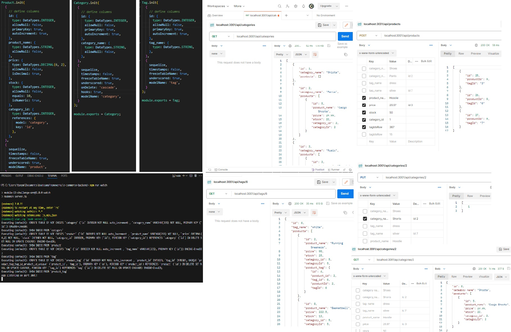

# E-Commerce Back-End

## Author
Tony Magrady - Berkeley Full-Stack Web Development Bootcamp student, Fall-Winter Session 2023-2024

## Badges

## Table of Contents

- [Description](#description)
- [Installation](#installation)
- [Usage](#usage)
- [Credits](#credits)
- [License](#license)

## Description

This is the back end for an E-Commerce website. An Express.js app framework was provided, and the API routes within needed to be developed. The front end has not yet been created; functionality is demonstrated using Postman API tool. Operating in Node.js environment, Sequelize models were created to construct and synchronize with a MySQL database.
The E-Commerce site product data is organized by category, but also stores one or many "hash tags^" or "labels" that can be associated with the product (in "tag" table). Tagging functionality is common in E-Commerce sites and social media apps.
^ - Not literally hash tags "#".

## Installation

Installed apps include Node.js (Javascript runtime), Express (web app framework), Mysql2 (database access), Sequelize (Object-relational mapping, ORM, of code to MySQL), and Dotenv (manages private environment variables for use in code).
Used Postman local application to test and demostrate API calls.

## Usage

To run locally:
- Access the repo root folder (...\e-commerce-backend).
- Seed database (npm run seed).
- Start server and enable database synchronization (npm run watch).
- Message is displayed "App listening on port 3001!", as server runs and waits.
- On client (localhost:3001/api/...).  Api/ is followed by categories, tags, or products to access routes.
    - Example: localhost:3001/api/products
- Available routes for all tables in Description are GET all, GET by ID key, POST (insert row), PUT (update row), and DELETE (delete row).

[Demo Link](https://watch.screencastify.com/v/0wJIyZxgtYotX5i0SgUo)  

## Credits

Excellent assistance from boot camp instructor, TAs, and classmates.

## License

The MIT License

Copyright (c) (2023) (Tony Magrady)

    Permission is hereby granted, free of charge, to any person obtaining a copy
    of this software and associated documentation files (the "Software"), to deal
    in the Software without restriction, including without limitation the rights
    to use, copy, modify, merge, publish, distribute, sublicense, and/or sell
    copies of the Software, and to permit persons to whom the Software is
    furnished to do so, subject to the following conditions:
    
    The above copyright notice and this permission notice shall be included in all
    copies or substantial portions of the Software.
    
    THE SOFTWARE IS PROVIDED "AS IS", WITHOUT WARRANTY OF ANY KIND, EXPRESS OR
    IMPLIED, INCLUDING BUT NOT LIMITED TO THE WARRANTIES OF MERCHANTABILITY,
    FITNESS FOR A PARTICULAR PURPOSE AND NONINFRINGEMENT. IN NO EVENT SHALL THE
    AUTHORS OR COPYRIGHT HOLDERS BE LIABLE FOR ANY CLAIM, DAMAGES OR OTHER
    LIABILITY, WHETHER IN AN ACTION OF CONTRACT, TORT OR OTHERWISE, ARISING FROM,
    OUT OF OR IN CONNECTION WITH THE SOFTWARE OR THE USE OR OTHER DEALINGS IN THE
    SOFTWARE.